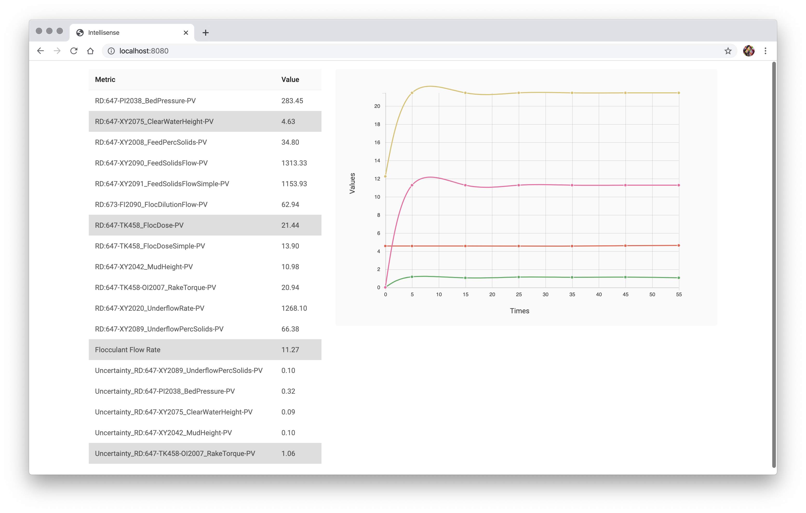

# Intellisense Data Visualization

This is a single page application to visualize data from the provided API endpoint in both a table and a line graph.

Data visualization and analysis is important to better understand the current state of the equipment and therefore make better decisions about it’s operation.

## 👀 Preview



## 🚀 Quick start

1. Download the project and cd into it:

   ```bash
   git clone https://github.com/junagao/intellisense-data-visualization.git
   cd intellisense-data-visualization
   ```

2. Install dependencies and run the application:

   ```bash
   yarn
   yarn dev
   ```

3. Open your browser and navigate to:

   http://localhost:8080/

## 📚 Tech Stack

- React 16
- Redux
  - Redux Dev Tools
  - Redux Thunk
- Webpack 4
- Babel 7
- Hot Module Replacement
- ESLint (airbnb styleguide)
- Prettier
- Husky
- lint-staged
- axios
- D3
- Styled Components
- Jest
- Enzyme

## Author

Juliane Nagao - [GitHub](https://github.com/junagao) - [LinkedIn](https://www.linkedin.com/in/junagao/)

## License

This project is licensed under the MIT License.
